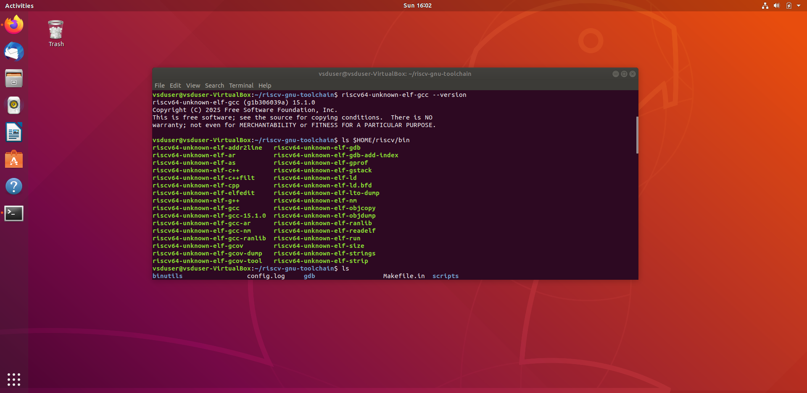
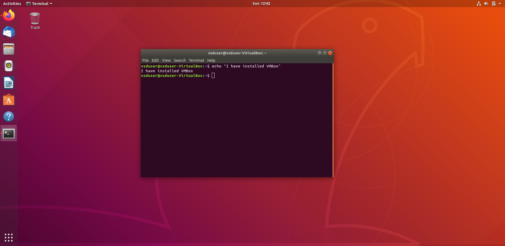
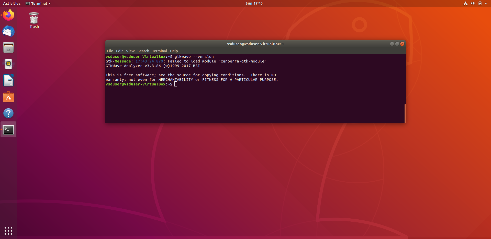
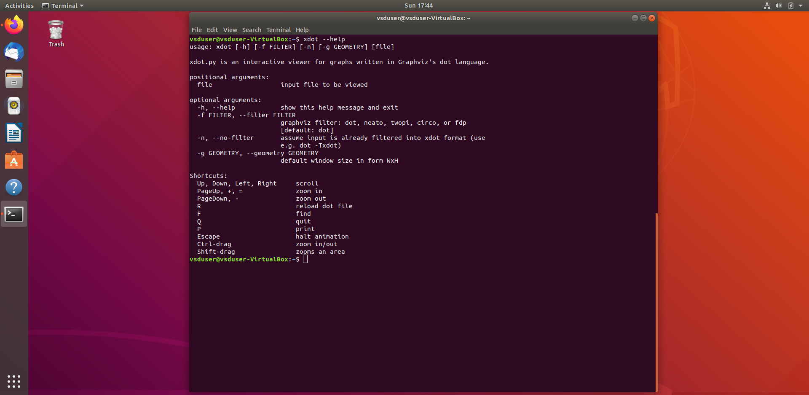
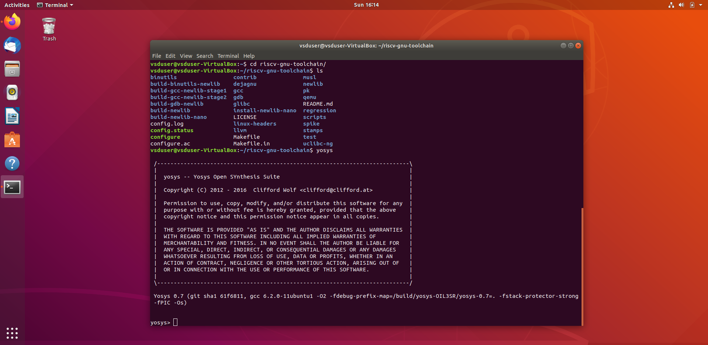
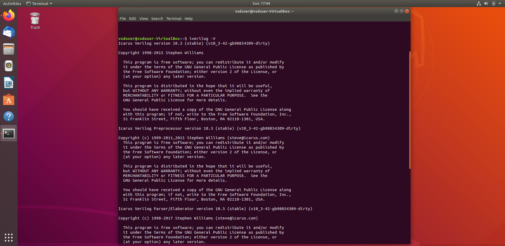

# Task 1 - RISC-V Design and Simulation

This task involves setting up the RISC-V toolchain and verifying a simple design using the following tools:

- Yosys
- GTKWave
- IVerilog
- RISCV toolchain

---
# 🧠 Task 1 - RISC-V Toolchain Setup & Simulation

This task covers setting up the RISC-V design environment and running simulation using open-source tools on Ubuntu.

---


## 🔧 Tool Installation Screenshots

### ✅ RISC-V Toolchain Installation

git clone https://github.com/riscv-collab/riscv-gnu-toolchain
cd riscv-gnu-toolchain
sudo apt install autoconf automake autotools-dev curl libmpc-dev libmpfr-dev libgmp-dev gawk build-essential bison flex texinfo gperf libtool patchutils bc zlib1g-dev libexpat-dev
./configure --prefix=/opt/riscv
make


### ✅ Ubuntu Installed


---

## 🧪 Waveform Output

### ✅ GTKWave Output

## 🔧 Toolchain Components

GTKWave is a waveform viewer for VCD (Value Change Dump) files generated from simulations.
sudo apt install gtkwave


### ✅ xdot View


---

## ⚙️ Synthesis and Simulation

### ✅ Yosys Synthesis Output


## 🔧 Toolchain Components

### 1. **Yosys**
> Yosys is an open-source framework for Verilog RTL synthesis.

📌 **Command Used:**
```bash
sudo apt install yosys


### ✅ IVerilog Compilation


## 🔧 Toolchain Components

Icarus Verilog (IVerilog) is a Verilog simulation and synthesis tool.
sudo apt install iverilog


